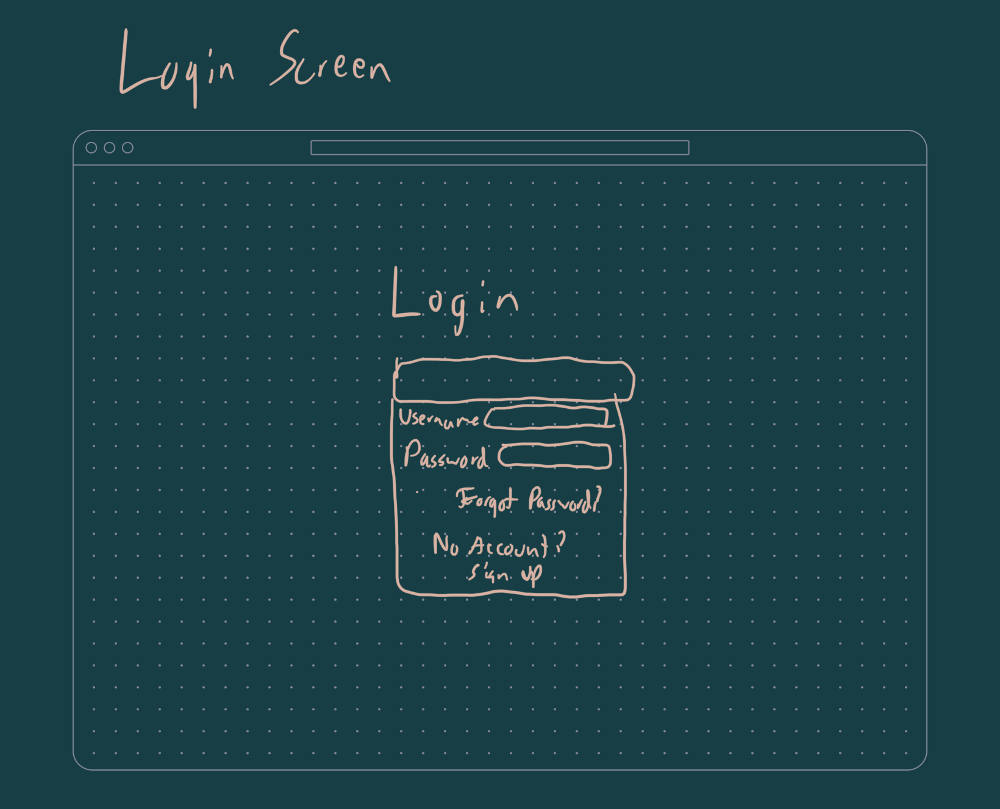
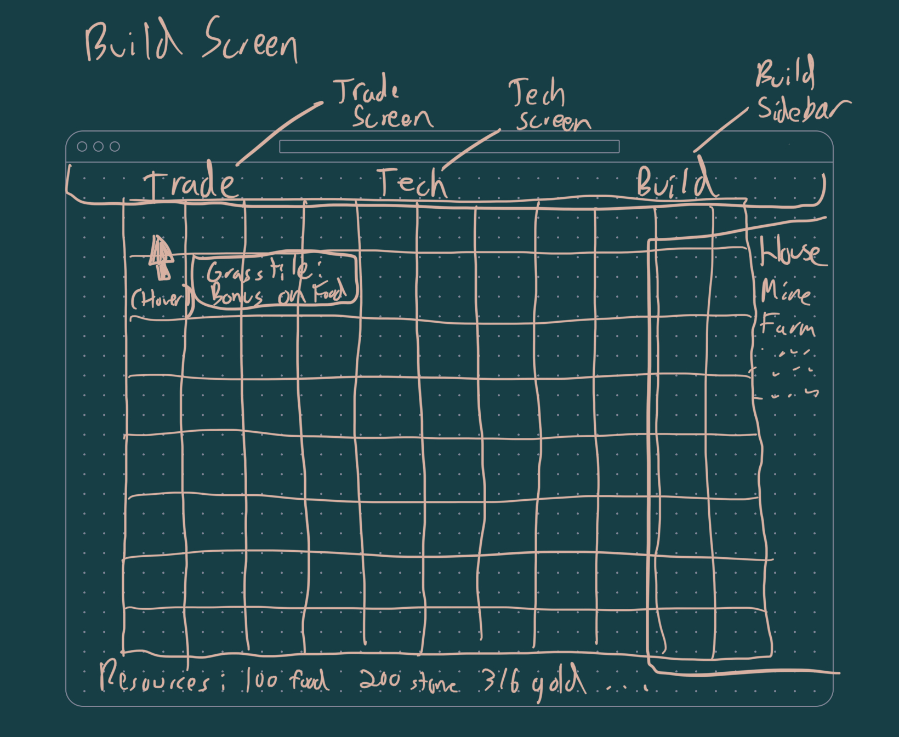
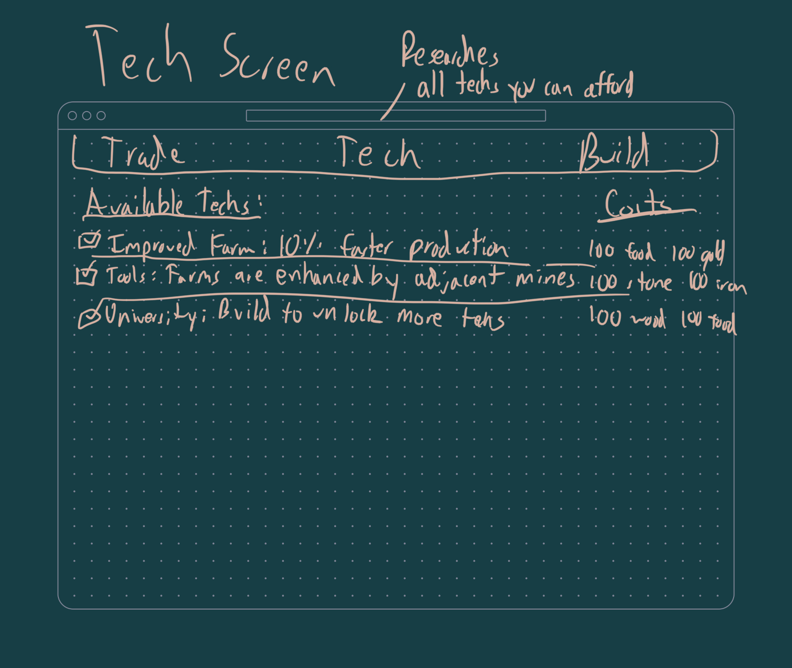
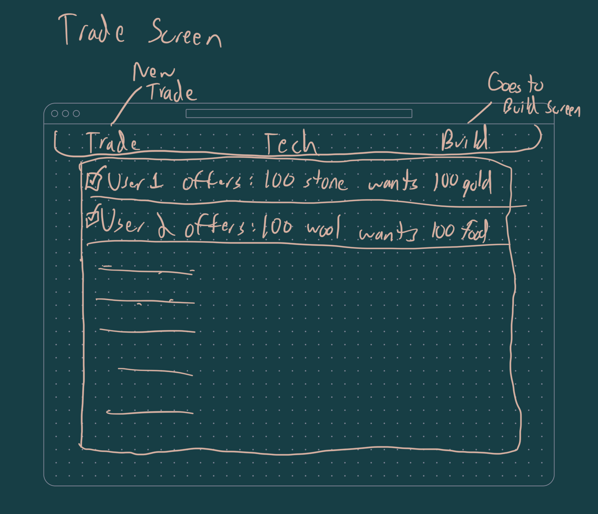

# startup
CS 260

# Elevator pitch:
TradeWorld is an online game where the player can gather resources, trade, and build a place to call home. You can interact with other players online to trade resources needed to turn your chunk of the world into whatever you want it to be. You can build houses, mansions, farms, mines, and more. The game offers an engaging progression system with tech research, building designs to unlock, and positioning and building strategies.

# Key features:
- Secure login
- Fully interactive and persistent map per user
- User to user interaction via item trades
- Reactive tech list view
- Leaderboard (stretch goal)
- Profile pictures served via Gravatar

# Sam's notes:

## Merge conflicts
When you make commits from two different locations that modify the same line without merging in the changes beforehand, you have to resolve the conflict manually when the pull fails.

## Simon HTML
I am a little confused why we are using an input element for the score. Shouldn't it be a static div that we update once we introduce functionality?

I think it's interesting that `<thead>` elements automatically center and bold their text. Is there a way to override that in the CSS?

I added `aria-label`s to the buttons so they are accessibility compliant.

## Simon CSS
I'm impressed how we got the unique shape of the simon gizmo using full corner radius on just one of the corners. I didn't realize you could set the corner radius on every corner separately.

I don't like how the sample code uses absolute positioning. It seems like it's pretty much always better to use flex and margins to position elements so they're fully reactive. After I centered the player element, I had to change the sizing of the gizmo so it wasn't overlapping. If I have more time I'd like to come back and try to fix it, my first try messing around with it I wasn't able to fix it and I feel like I might be slighty constrained by the fact that the outer container is a bootstrap element.

I also want to restyle the Simon logo in the top left but it's a bootstrap class. I like the flexibility of tailwind more.

## Simon JS
The sample code used an interesting syntax that we didn't see in any js Wassignments. Prefixig `#` to methods/members in a class makes them private.

Javascript that touches the DOM is VERY brittle once you start moving around/renaming elements. It is making my spidey senses go off, don't couple UI to business logic!

We're also using a global/singleton `Game` object, though I'm not sure how to do this without global scope. What do you do when you want mock something?

## Simon Service
If I were making this my own way I would have the server template the scoreboard html before it serves it rather than fetching it. Templating seems easier to work with than js fiddling with the DOM. I wonder why we aren't learning something like handlebars in this class.

Services are a good step in the direction of decoupling logic from UI.

## Simon DB
I'm not exactly sure what `pm2` is, but I had to add `--update-env` to the bash script to get it to read my new environment vars. It's amazingly robust, it even persisted between reboots.

You introduce a tiny bit of latency by querying from the AtlasDB rather than your local application storage.
